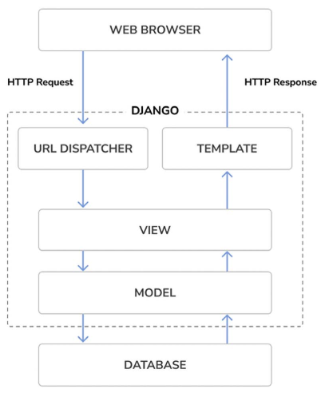
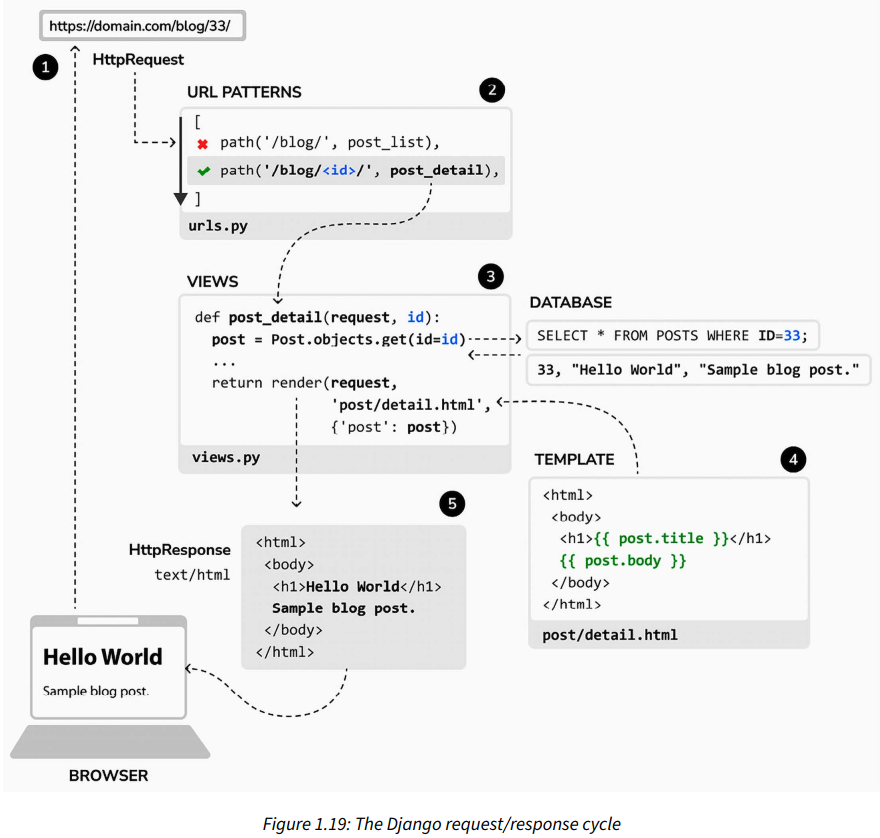
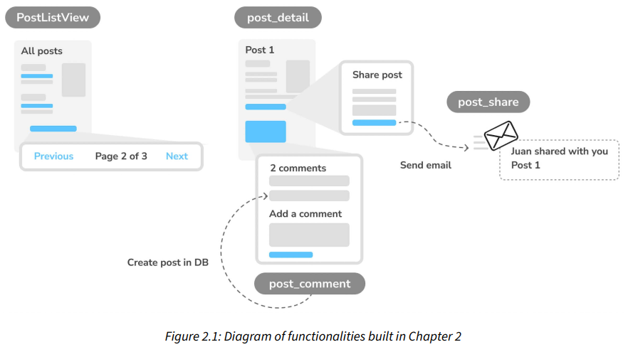
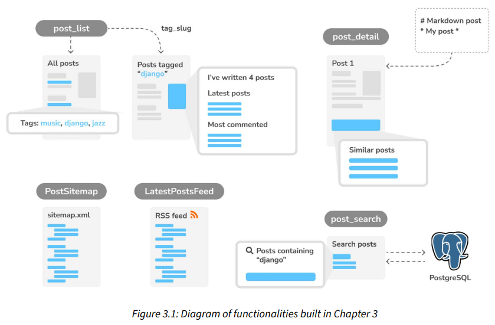
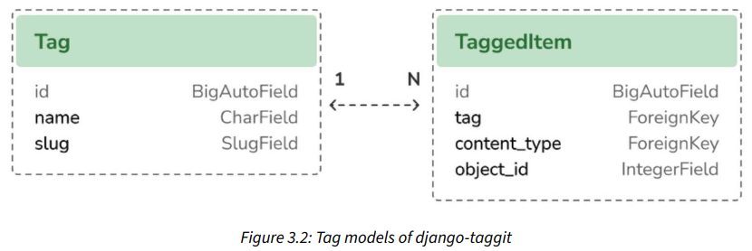
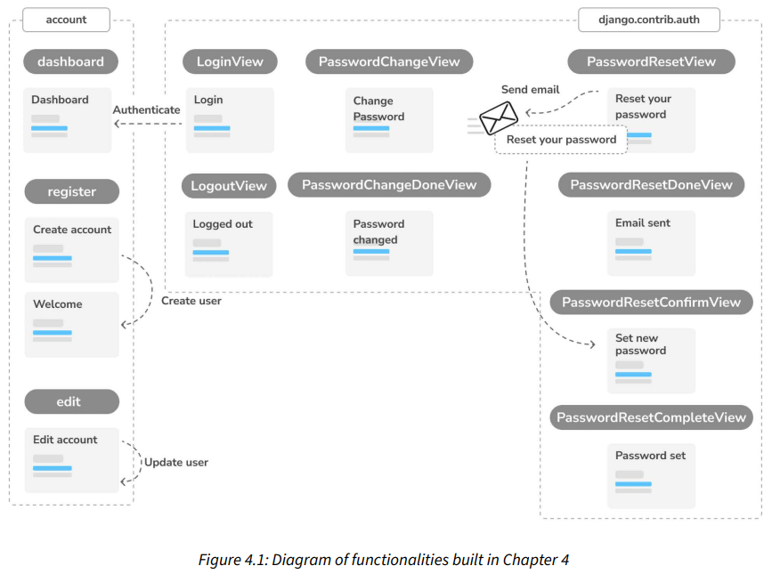
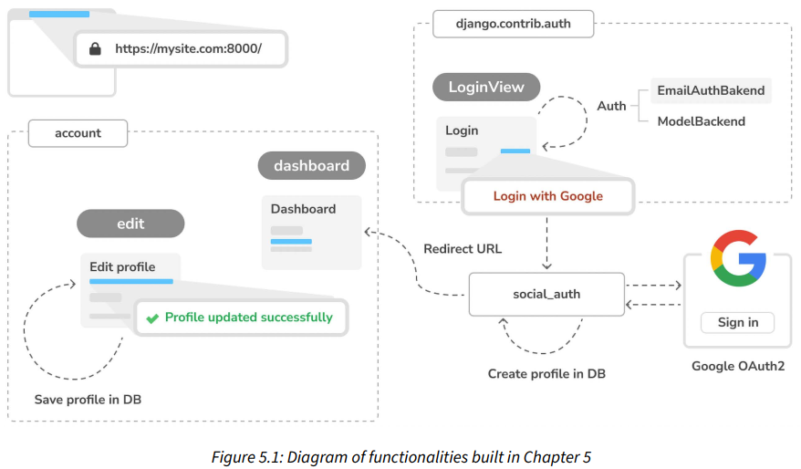
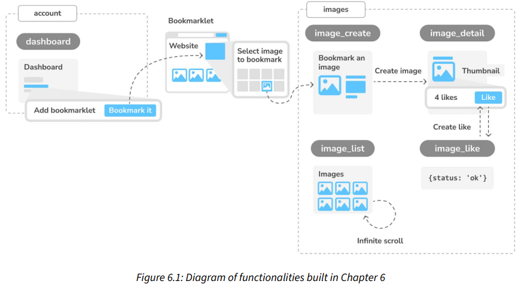
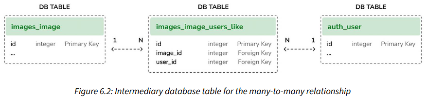

# Preface

## What this book covers

- Four fully-featured web applications
  1. **Blog** (chapters 1 to 3)
     - Content management
     - Commenting
     - Post sharing
     - Search
     - Post recommendations
  2. **Image bookmarking** (chapters 4 to 7)
     - Authentication system
  3. **Online shop** (chapters 8 to 11)
  4. **e-learning platform** (chapters 12 to 17)

# 1 Building a Blog Application

- Covers the essential building blocks, **important Django project settings**.
- **Major components** - models, templates, views, and URLs.
- Features to build:
  - Navigate through all **published** posts.
  - Read individual posts.
  - **Admin site** to manage and publish posts.

## Installing Python

- In **Windows**, `py` is the Python launcher. It delegates to the **latest version**.

## Django overview

### Main framework components

- **MTV (Model-Template-View)** pattern:

  | Component | Responsibility                                                                                                                                  |
  | --------- | ----------------------------------------------------------------------------------------------------------------------------------------------- |
  | Model     | - Data structure.<br />- **Data handler** between the database and the view.<br />- Provides **data definitions** and **behaviors** (ORM APIs). |
  | Template  | - **Presentation layer**.                                                                                                                       |
  | View      | - Communicates with the database via the **model**.<br />- Transfers the data to the **template** for viewing.                                  |

- Django sends a **request** to the appropriate **view**, according to the **URL configuration**.

### The Django architecture



## Creating your first project - `django-admin startproject`

- To create a Django project, named `mysite`:
  ```bash
  $ django-admin startproject mysite
  ```
- **Outer** `mysite/` is the **container for our project**. It contains:
  - `manage.py` - **Command-line utility** used to interact with your project.
  - `mysite/` - **Python package for your project**. It contains:
    - `__init__.py`
    - `asgi.py`
      - **Configuration** to run your project with **ASGI-compatible web servers**.
      - **Emerging standard** for **asynchronous** web servers and applications.
    - `settings.py` - Settings and configuration for your project.
    - `urls.py` - Contains **URL patterns**. Each URL is **mapped to a view**.
    - `wsgi.py` - **Configuration** to run your project with **WSGI-compatible web servers**.

### Applying initial database migrations - `migrate`

- In `settings.py`, `INSTALLED_APPS` constant contains **common Django applications** that are **added** to your project **by default**.
- To complete the project setup, you need to **create the tables** associated with the models of the **default Django applications**.
  ```bash
  $ python manage.py migrate
  ```

### Running the development server - `runserver`

- Keeps **checking for changes** and **reloads** automatically.
- **Might not notice** some actions, such as **adding new files**.
- To start the development server:

  ```bash
  $ python manage.py runserver

  # To run on a custom host and port or to load a specific settings file.
  $ python manage.py runserver 127.0.0.1:8001 --settings=mysite.settings
  ```

- Only intended for development.
- **For production**, use the following web servers:
  1. **WSGI**-compatible - Apache, Gunicorn, or uWSGI.
  2. **ASGI**-compatible - Daphne or Uvicorn.

### Project settings - `settings.py`

- By default, Django includes **only part** of [all the settings](https://docs.djangoproject.com/en/5.0/ref/settings/).
- Notable project settings:

  | Setting          | Description                                                                                                      |
  | ---------------- | ---------------------------------------------------------------------------------------------------------------- |
  | `ALLOWED_HOSTS`  | When `DEBUG` is `False` (production), you'll have to add your domain/host to allow it to serve your Django site. |
  | `INSTALLED_APPS` | Indicates which applications are active for this site.                                                           |
  | `USE_TZ`         | Provides support for timezone-aware datetime.                                                                    |

### Projects and applications

- **Project** is a **Django installation** with some **settings**.
- **Application** is a **group** of models, views, templates, and URLs.

### Creating an application - `startapp`

- To create an application, named `blog`:
  ```bash
  $ python manage.py startapp blog
  ```
- `blog/` contains:
  - `__init__.py`
  - `admin.py` - **Register models** to include them in the **Django admin site**.
  - `apps.py` - Main **configuration** of the application.
  - `migrations/` - Contains **database migrations**.
  - `models.py` - All Django applications **must have** a `models.py` file.
  - `tests.py`
  - `views.py` - Logic of your application.

## Creating the blog data models

- A Django model is a **source of information** about the **behaviors** of your data.
- Subclass `django.db.models.Model` to create a model.
- Each model maps to a **single database table**.

### Creating the Post model

- **Model field types** used:

  | Field           | Description                                                                                                                                                                                                                                        |
  | --------------- | -------------------------------------------------------------------------------------------------------------------------------------------------------------------------------------------------------------------------------------------------- |
  | `CharField`     | - `VARCHAR` column.                                                                                                                                                                                                                                |
  | `SlugField`     | - `VARCHAR` column.<br />- A short label that **contains only letters, numbers, underscores, or hyphens**.<br />- **E.g.** Django Reinhardt: A legend of Jazz -> django-reinhardt-legend-jazz<br />- **Use case:** To build **SEO-friendly URLs**. |
  | `TextField`     | - `TEXT` column.                                                                                                                                                                                                                                   |
  | `DateTimeField` | - `DATETIME` column.                                                                                                                                                                                                                               |

- Django uses `__str__()` to display the object name in many places, such as the **admin site**.
- **By default**, Django **adds an auto-incrementing primary key field** (`id`) to each model.
  - **Field type for this** is specified in each app config (`apps.py`) or globally in the `settings.py` (`DEFAULT_AUTO_FIELD`).
  - Default field type - `BigAutoField` (64-bit integer)
  - Set `primary_key=True` on a field to make it the primary key.

### Adding datetime fields - `models.DateTimeField()`

- Ways to define the **default value** for the `DateTimeField`:

  ```py
  class Post(models.Model):
      # Method 1:
      # Use `django.utils.timezone` module to handle datetime in
      #   a timezone-aware manner.
      publish = models.DateTimeField(default=timezone.now)

      # Method 2:
      # Database-computed default values (introduced in Django 5)
      #   by using `django.db.models.functions.Now`.
      publish = models.DateTimeField(db_default=Now())
  ```

- By using `auto_now_add`, the date will be **saved automatically when creating** an object.
- By using `auto_now`, the date will be **updated automatically when saving** an object.
- Additional resources:
  - [`db_default` attribute](https://docs.djangoproject.com/en/5.0/ref/models/fields/#django.db.models.Field.db_default)
  - [Database functions](https://docs.djangoproject.com/en/5.0/ref/models/database-functions/)

### Defining a default sort order - `<Model>.Meta.ordering`

- Takes effect **when retrieving objects** (`ORDER BY`) from the database.

  ```py
  class Post(models.Model):
      ...

      # Defines metadata.
      class Meta:
          ...
          ordering = ["-publish"]  # Descending order.
  ```

### Adding a database index - `<Model>.Meta.indexes`

- **Note:** Index ordering is not supported on MySQL. A descending index will be created as a normal index.

  ```py
  class Post(models.Model):
      ...

      # Defines metadata.
      class Meta:
          ...
          indexes = [
              models.Index(fields=["-publish"])  # Descending index.
          ]
  ```

- Additional resource - [How to define indexes for models](https://docs.djangoproject.com/en/5.0/ref/models/indexes/)

### Activating the application - `INSTALLED_APPS`

- Activate the `blog` application **in the project** and be able to **create database tables** for its models.
- Add the app config (`blog.apps.BlogConfig`) to the `INSTALLED_APPS` setting in `settings.py`. This enables the project to load the app models.

### Adding a status field (enum) - `models.TextChoices`

```py
class Post(models.Model):
    # Enum type
    class Status(models.TextChoices):
        DRAFT = "DF", "Draft"
        PUBLISHED = "PB", "Published"

    # Model fields.
    ...
    status = models.CharField(
        max_length=2,
        choices=Status,  # <--
        default=Status.DRAFT
    )
```

| `TextChoices` attribute | Description                                              |
| ----------------------- | -------------------------------------------------------- |
| `Post.Status.choices`   | Available choices (tuple).                               |
| `Post.Status.names`     | Names of the choices (class variables).                  |
| `Post.Status.labels`    | Human-readable names (2nd element of the tuple).         |
| `Post.Status.values`    | Actual values of the choices (1st element of the tuple). |

- Specify the field's `choices` parameter to limit the value.
- **Good practice:** Define choices **inside the model class**, allowing you to **easily reference** choice labels, values, or names.

### Adding a many-to-one relationship - `models.ForeignKey`

- **One author** (user) can create **many posts**.
- Can use the `User` model provided by the **Django authentication framework** (`django.contrib.auth` package).
- Use `AUTH_USER_MODEL` setting (points to `auth.models.User` by default) **when defining the foreign key** field.

  ```py
  from django.conf import settings  # Project's settings.

  class Post(models.Model):
      # Model fields
      ...
      author = models.ForeignKey(
          settings.AUTH_USER_MODEL,
          # `CASCADE` - Deleting a user will also delete his/her posts as well.
          on_delete=models.CASCADE,
          # Specifies the name of the reverse relationship, `user.blog_posts`.
          related_name="blog_posts"
      )
  ```

- Additional resources:
  - [Possible values for `on_delete`](https://docs.djangoproject.com/en/5.0/ref/models/fields/#django.db.models.ForeignKey.on_delete)
  - [Field types](https://docs.djangoproject.com/en/5.0/ref/models/fields/)

### Creating and applying migrations - `makemigrations` and `migrate`

- To create a migration for an app, named `blog`:
  ```bash
  python manage.py makemigrations blog
  ```
- A migration specifies **dependencies** on other migrations and **operations** to perform in the database.
- To get the **SQL** for a migration:
  ```bash
  $ python manage.py sqlmigrate blog 0001
  ```
- Django generates the **table names** by **combining** the **app name** and the **model name in lowercase**, `blog_post`.
- Define `Meta.db_table` attribute to **explicitly specify** the table name.
- Fields that **create an index by default**:
  - `SlugField`
  - `ForeignKey`
  - Fields with `unique=True`
- To apply the **pending migrations** of all **activated apps** (`INSTALLED_APPS`):
  ```bash
  $ python manage.py migrate
  ```

## Creating an administration site for models

- Django has a **built-in admin site**. It is **built dynamically** by reading the **model metadata**.

### Creating a superuser - `createsuperuser`

- To create a user **to manage the admin site**.
  ```bash
  $ python manage.py createsuperuser
  ```

### The Django administration site

- Default URL - `http://<host>:<port>/admin/`

### Adding models to the administration site

```py
admin.site.register(Post)
```

- Django uses **different form widgets** for each type of field.

### Customizing how models are displayed

```py
# blog/admin.py

@admin.register(Post)
class PostAdmin(admin.ModelAdmin):
    list_display = ["title", "slug", "author", "publish", "status"]
    list_filter = ["status", "created", "publish", "author"]
    search_fields = ["title", "body"]  # Search bar
    prepopulated_fields = {"slug": ("title",)}
    raw_id_fields = ["author"]  # User lookup widget
    date_hierarchy = "publish"  # Date breadcrumbs (below search bar)
    ordering = ["status", "publish"]  # Overrides the default sort order of the model.
    show_facets = admin.ShowFacets.ALWAYS  # Object counts for each filter.
```

- Model (`Post`) is registered in the site using a **custom class** that inherits from `ModelAdmin`.
- `show_facets` is introduced in **Django 5.0**.
- Additional resource: [Django admin site](https://docs.djangoproject.com/en/5.0/ref/contrib/admin/)

## Working with QuerySets and managers (Django ORM)

- Django ORM **supports** MySQL, PostgreSQL, SQLite, Oracle, and MariaDB.
- `DATABASES` setting in `settings.py` defines the database used.
- Can implement **database routers** to create custom **data routing schemes** to work with **multiple databases**.
- Django ORM is based on **QuerySets** (SQL `SELECT`).
- **Filters** are limiting SQL clauses such as `WHERE` or `LIMIT`.
- Additional resource: [Model API reference](https://docs.djangoproject.com/en/5.0/ref/models/)

### Creating objects

```py
from django.contrib.auth.models import User
from blog.models import Post

# Ues `get()` to retrieve a single object.
# If no results, raise a `User.DoesNotExist`.
# If more than one result, raise a `User.MultipleObjectsReturned`.
user = User.objects.get(username="admin")

post = Post(title="Another post", slug="another-post", body="Post body.", author=user)
post.save()  # Save to database.

# Use `create()` to create the object and persist it to the database in
#   a single operation.
Post.objects.create(title="One more post", slug="one-more-post", body="Post body.", author=user)

# Use `get_or_create()` to fetch an object from the database or create it
#   if it's absent.
# Returns a tuple (object_retrieved, is_newly_created)
user2, created = User.objects.get_or_create(username="user2")
```

### Updating objects

```py
post.title = "New title"
post.save()
```

### Retrieving objects

- Each model has **at least one manager**.
- `<Model>.objects` is the default manager.
- Use `all()` to retrieve all objects from a table.
  ```py
  # This QuerySet has not been executed yet (lazy).
  all_posts = Post.objects.all()
  ```

### Filtering objects

- Use `filter()` to filter a QuerySet (SQL `WHERE`).
  ```py
  posts = Post.objects.filter(title="Who was Django Reinhardt?")
  print(posts.query)  # SQL generated
  ```

### Using field lookups

- QuerySet API provides multiple **lookup types**. (**CI** - case-insensitive)

  | Lookup type                           | Description                                                                        |
  | ------------------------------------- | ---------------------------------------------------------------------------------- |
  | `exact`,<br />`iexact` (CI)           | - Exact match (Default).                                                           |
  | `contains`,<br />`icontains` (CI)     | - SQL `LIKE`.<br />- E.g. `WHERE title LIKE '%Django%'`                            |
  | `in`                                  | - Lookup with a iterable (list, tuple, another QuerySet).<br />- SQL `IN`          |
  | `gt`, `gte`, `lt`, `lte`              | - Greater than, greater than or equal to, less than, less than or equal to lookup. |
  | `startswith`,<br />`istartswith` (CI) | - Starts-with lookup.<br />- SQL `LIKE`                                            |
  | `endswith`,<br />`iendswith` (CI)     | - Ends-with lookup.<br />- SQL `LIKE`                                              |

- Lookup types for `DateField` or `DateTimeField`:

  | Date lookup type       | Description                 |
  | ---------------------- | --------------------------- |
  | `date`                 | Exact date lookup.          |
  | `year`, `month`, `day` | Filter by year, month, day. |

- **Two underscores** (`__`) are used to define the lookup type.
- Examples:

  ```py
  # Exact match.
  Post.objects.filter(id__exact=1)
  Post.objects.filter(id=1)
  #   Case-insensitive version.
  Post.objects.filter(title__iexact="who was django reinhardt?")

  # SQL `LIKE`
  Post.objects.filter(title__contains="Django")
  #   Case-insensitive version
  Post.objects.filter(title__icontains="django")

  # Lookup with a iterable.
  Post.objects.filter(id__in=[1, 3])

  # Greater than lookup.
  Post.objects.filter(id__gt=3)
  # Greater than or equal to lookup.
  Post.objects.filter(id__gte=3)
  # Less than lookup.
  Post.objects.filter(id__lt=3)
  # Less than or equal to lookup.
  Post.objects.filter(id__lte=3)

  # Starts-with lookup.
  Post.objects.filter(title__istartswith="who")
  # Ends-with lookup.
  Post.objects.filter(title__iendswith="reinhardt?")

  # Exact date lookup.
  from datetime import date
  Post.objects.filter(publish__date=date(2024, 1, 31))

  # Filter by year.
  Post.objects.filter(publish__year=2024)
  # Filter by month.
  Post.objects.filter(publish__month=1)
  # Filter by day.
  Post.objects.filter(publish__day=1)

  # Chain additional lookups.
  Post.objects.filter(publish__date__gt=date(2024, 1, 1))

  # Lookup related object fields.
  Post.objects.filter(author__username="admin")
  #   Chain additional lookups for related fields.
  Post.objects.filter(author__username__startswith="ad")

  # Filter by multiple fields.
  Post.objects.filter(publish__year=2024, author__username="admin")
  ```

### Chaining filters

```py
Post.objects.filter(publish__year=2024) \
            .filter(author__username="admin")
```

### Excluding objects - `exclude()`

```py
Post.objects.filter(publish__year=2024) \
            .exclude(title__startswith="Why")
```

### Ordering objects - `order_by()`

```py
# Ascending order.
Post.objects.order_by("title")

# Descending order.
Post.objects.order_by("-title")

# Order by multiple fields.
Post.objects.order_by("author", "title")

# Use `?` to order randomly.
Post.objects.order_by("?")
```

### Limiting QuerySets (array-slicing)

```py
# SQL `LIMIT 5`
Post.objects.all()[:5]

# SQL `LIMIT 3 OFFSET 3`
Post.objects.all()[3:6]

# To retrieve a single object in random order.
Post.objects.order_by("?")[0]
```

### Counting objects - `count()`

```py
# SQL `SELECT COUNT(*)`
Post.objects.filter(id__lt=3).count()
```

### Checking if an object exists - `exists()`

```py
# To check if a QuerySet contains any results.
Post.objects.filter(title__startswith="Why").exists()
```

### Deleting objects - `delete()`

```py
post = Post.objects.get(id=1)
post.delete()
```

### Complex lookups with `Q` objects

- Field lookups using `filter()` are joined with a SQL `AND`.
- Use `Q` objects to build **complex queries**, such as queries with `OR`.
- `Q` object encapsulates **a collection of field lookups**.
- Can **compose statements** by combining `Q` objects with the `&`, `|`, and `^` operators.

  ```py
  from django.db.models import Q

  starts_who = Q(title__istartswith="who")
  starts_why = Q(title__istartswith="why")
  Post.objects.filter(starts_who | starts_why)
  ```

- Additional resource: [Q objects](https://docs.djangoproject.com/en/5.0/topics/db/queries/#complex-lookups-with-q-objects)

### When QuerySets are evaluated

- QuerySets are **only evaluated** when:
  - **Iterate** over them.
  - **Pickle** or cache them
  - Call `repr()` or `len()` on them
  - Call `list()` on them.
  - **Test** them in a statement, such as `bool()`, `or`, `and`, `if`

### More on QuerySets

- Additional resources:
  - [QuerySet API reference](https://docs.djangoproject.com/en/5.0/ref/models/querysets/)
  - [Making queries](https://docs.djangoproject.com/en/5.0/topics/db/queries/)

### Creating model managers - `models.Manager`

- `<Model>.objects` is the default manager. It retrieves all the objects.
- Can define **custom managers** to **filter** the objects to be retrieved.
- Two ways to add or customize managers:

  1. **Add methods** to an **existing** manager.
     - `Post.objects.my_manager()`
  2. Create a **new** manager by **modifying the initial QuerySet** - `super().get_queryset()`.

     - `Post.my_manager.all()`
     - **First manager** defined becomes the **default manager**.
     - Django will **not create** the `objects` manager if the model **defines another manager**. So, **define it explicitly** to keep it.

     ```py
     class PublishedManger(models.Manager):
         def get_queryset(self):
             return super().get_queryset().filter(status=Post.Status.PUBLISHED)

     class Post(models.Model):
         # Model fields.
         ...
         objects = models.Manager()  # Default manager.
         published = PublishedManager()  # Custom manager.
     ```

## Building list and detail views

- Three steps to build web pages:
  1. Create your application views.
  2. Define a URL pattern for each view.
  3. Create HTML templates to render the data generated by the views.

### Creating list and detail views

- `request` parameter is **required** by all views.
- Use **`render()` shortcut** to render the web page with the given **template** and the **context object**.

### Using the `get_object_or_404` shortcut

- Same as `<Model>.objects.get()` except it raises `Http404` exception if no object is found.

### Adding URL patterns for your views - `urlpatterns`

- URL patterns **map** URLs to views.
- **First**, create a `<app>/urls.py` for your app as it is **not created by default**.

  - `<parameter>` is captured as a **string**.
  - Use [**path converters**](https://docs.djangoproject.com/en/5.0/topics/http/urls/#path-converters) for matching.
    - `<int:year>` - Match and return an integer.
    - `<slug:post>` - Match a slug.

  ```py
  # blog/urls.py

  from django.urls import path
  from . import views

  app_name = "blog"  # App namespace

  urlpatterns = [
      # Post views
      path("", views.post_list, name="post_list"),
      # Use `<>` to capture values from the URL.
      path("<int:id>/", views.post_detail, name="post_detail"),
  ]
  ```

- Use `re_path()` to define **complex** URL patterns with **regular expressions**.
- Creating a `urls.py` for each application makes your apps reusable by other projects.
- **Next**, include the **app URL patterns** (`<app>/urls.py`) in the **project (main) URL patterns** (`<proj>/urls.py`).

  - Use `include()` to define the **app URLconf**.
  - [**URL namespaces**](https://docs.djangoproject.com/en/5.0/topics/http/urls/#url-namespaces) have to be **unique** across entire project.

  ```py
  # mysite/urls.py

  from django.contrib import admin
  from django.urls import path, include

  urlpatterns = [
      path("admin/", admin.site.urls),
      path("blog/", include("blog.urls", namespace="blog")),
  ]
  ```

## Creating templates for your views

- [Django template language reference](https://docs.djangoproject.com/en/5.0/ref/templates/language/)
- **File structure** for the templates inside the **app directory**:
  - `base.html` include the main HTML structure.
  - `list.html` and `detail.html` inherit from the `base.html`.
  ```
  templates/
      blog/
          base.html
          post/
              list.html
              detail.html
  ```
- Components that **control how data is displayed**:

  | Component                                 | Description                     |
  | ----------------------------------------- | ------------------------------- |
  | Template tags ``                 | - Control the rendering.        |
  | Template variables `{{ variable }}`       | - Get replaced with values.     |
  | Template filters `{{ variable\|filter }}` | - Modify variables for display. |

- Additional resource: [Built-in template tags and filters](https://docs.djangoproject.com/en/5.0/ref/templates/builtins/)

### Creating a base template - `base.html`

- Template tags used:

  | Template tag        | Description                                                                                             |
  | ------------------- | ------------------------------------------------------------------------------------------------------- |
  | `` | - Loads the **`static` custom template tags**.<br />- Provided by the `django.contrib.staticfiles` app. |
  | ``      | - To include static files.<br />- `<app>/static/` is the **default directory** for static files.        |
  | ``       | - Templates that inherit from the `base.html` can fill in the block.                                    |

### Creating the post list template - `post/list.html`

- Template tags used:

  | Template tag    | Description                                                                                                    |
  | --------------- | -------------------------------------------------------------------------------------------------------------- |
  | `` | - To **inherit** from the `<app>/base.html`.                                                                   |
  | ``     | - To **build URLs dynamically** by URLs name.<br />- `<a href="">Link</a>` |

- Template filters used:
  - `truncatewords`
  - `linebreaks` - Converts newline (e.g. `\n`) into HTML line breaks (e.g. `<p>`).
- Can **concatenate** multiple template filters. Each filter will be applied to the output generated by the **preceding one**.
  ```django
  {{ post.body|truncatewords:30|linebreaks }}
  ```

## The request/response cycle

- **Basic reference** for how Django processes requests (**doesn't include middleware**, for the sake of simplicity).

  

## Management commands used in this chapter

- [`startproject`](#creating-your-first-project---django-admin-startproject)
- [`startapp`](#creating-an-application---startapp)
- [`migrate`](#applying-initial-database-migrations---migrate)
- [`makemigrations`, `sqlmigrate`](#creating-and-applying-migrations---makemigrations-and-migrate)
- [`runserver`](#running-the-development-server---runserver)
- [`createsuperuser`](#creating-a-superuser---createsuperuser)
- Additional resource: [Full list of available management commands](https://docs.djangoproject.com/en/5.0/ref/django-admin/)

# 2 Enhancing Your Blog and Adding Social Features

- Features to build:
  - Canonical URL for the model
  - SEO-friendly URL
  - Pagination
  - Class-based view
  - Send emails via SMTP
  - Share posts via email using `forms.Form`
  - Add comments using `forms.ModelForm`

## Functional overview



## Using canonical URLs for models - `get_absolute_url()`

- **Canonical URL** - The preferred/most representative/main URL for a resource.
- Implement `get_absolute_url()` **in models** to return the canonical URL.
- Use a **URL pattern name** (e.g. `blog:post_detail`) in `blog/urls.py` to build the canonical URL.
- Django has **different URL resolver functions** to build URLs dynamically, such as `django.urls.reverse()`.

  ```py
  from django.urls import reverse

  def get_absolute_url(self):
      return reverse(
          "blog:post_detail",  # URL name.
          args=[self.publish.year, self.publish.month, self.publish.day, self.slug],
      )
  ```

- Additional resource: [URL's utility functions](https://docs.djangoproject.com/en/5.0/ref/urlresolvers/)

## Creating SEO-friendly URLs for posts

- Create a SEO-friendly URL using the `publish` date and `slug`, such as `/blog/2024/1/1/who-was-django-reinhardt/`.
- **Must ensure** that no post can be stored in the database with the same `publish` date and `slug`.

  - Define `slug` to be unique for the `publish` date.
  - Check for unique values **only against the date** (not the time).
  - `unique_for_date` is **not enforced at the database level**, so no database migration.
  - **However**, we will still **create a migration** and apply it since Django uses migrations **to keep track of all model changes**.

  ```py
  class Post(models.Model):
      slug = models.SlugField(
          max_length=250,
          unique_for_date="publish"
      )
  ```

## Adding pagination - `Paginator`

- Django has a **built-in pagination class** to manage paginated data easily by specifying the number of objects per page.

### Adding pagination to the post list view

```py
from django.core.paginator import Paginator

def post_list(request):
    post_list = Post.published.all()

    # Pagination with 3 posts per page.
    paginator = Paginator(post_list, 3)
    # Retrieve the HTTP `GET` parameter. (Default: 1st page)
    page_number = request.GET.get("page", 1)
    posts = paginator.page(page_number)  # `Page` object.

    ...
```

### Creating a pagination template - `pagination.html`

- A generic template (**reusable**) to display **pagination links**.
- The template **expects** to have a `Page` object (`page`) in the context.
- Use `` to load the pagination template (e.g. `pagination.html`) into a page template (e.g. `blog/post/list.html`).

  - Use `with` to pass **additional context variables**.

  ```django
  ...

  
    ...
    
  
  ```

### Handling pagination errors - `EmptyPage`, `PageNotAnInteger`

- `page` **query string parameter** could have wrong values:

  - Non-existing page numbers (out of range)
    - `Paginator` object throws an `EmptyPage` exception.
    - Can return the **last page** to handle it.
  - Not an integer -`Paginator` object throws an `PageNotAnInteger` exception.
    - Can return the **First page** to handle it.

  ```py
  from django.core.paginator import EmptyPage, PageNotAnInteger
  ...

  def post_list(request):
      ...
      try:
          posts = paginator.page(page_number)
      except EmptyPage:
          # If page_number is out of range get last page of results.
          posts = paginator.page(paginator.num_pages)
      except PageNotAnInteger:
          # If page_number is not an integer get the first page.
          posts = paginator.page(1)

      ...
  ```

## Building class-based views - `django.views.generic`

- **Alternative** to function-based views.
- Django provides **base view classes** (all inherit from `View`), which handles **HTTP method dispatching**.

### Why use class-based views

- **Organize code** related to **HTTP methods**, instead of using conditional branching.
- Use multiple inheritance (**mixins**) to create **reusable** view classes.

### Using a class-based view to list posts - `ListView`

- Create a class that **inherit** from `ListView`.

  ```py
  # Similar to the `post_list` view, except the exception handling is a bit different.
  class PostListView(ListView):
      """
      Alternative post list view.
      """
      # Alternatively, define `model = Post` and Django will built
      #   the generic `Post.objects.all()` QuerySet.
      queryset = Post.published.all()
      context_object_name = "posts"  # Default: `object_list`
      paginate_by = 3
      template_name = "blog/post/list.html"  # Default: `blog/post_list.html`
  ```

- To use the `PostListView` class in a URL pattern (`blog/urls.py`):

  ```py
  urlpatterns = [
      # path("", views.post_list, name="post_list"),
      path("", views.PostListView.as_view(), name="post_list"),
  ]
  ```

- `ListView` passes the `Page` object in a variable called `page_obj`.

  ```django
  ...

  
    ...
    
  
  ```

- **Exception handling is different** - `ListView` returns `Http404` when the `page` query string parameter is invalid.
- **More** about class-based views in **Chapter 13**.
- Additional resource: [Introduction to class-based views](https://docs.djangoproject.com/en/5.0/topics/class-based-views/intro/)

## Recommending (sharing) posts by email

- To share posts via email:
  1. Create a **Django form** (`EmailPostForm`).
  2. Create a **view** (`post_share`) to **handle posted data** and **send email**.
  3. Add a URL pattern.
  4. Create a template to display the form.

### Creating forms with Django - `<app>/forms.py`

- Django has a **built-in forms framework**.
  - To define **form fields** (how they are **displayed**, how they **validate input**).
- Two **base classes** to build forms:

  1. `forms.Form`

     - Standard forms.
     - Each **field type** has a **default widget** (**can be overriden** with the `widget` attribute), such as `CharField` is rendered as an `<input type="text">`.

     ```py
     from django import forms

     class EmailPostForm(forms.Form):
         # * Form fields.
         # Use different field types to validate data.
         name = forms.CharField(max_length=25)
         email = forms.EmailField()
         to = forms.EmailField()
         # Optional field.
         comments = forms.CharField(required=False, widget=forms.Textarea)
     ```

  2. `ModelForm`

     - Forms that are tied to **model instances**.
     - **Form fields** can be **explicitly defined**, or automatically **generated from model fields**.

- Additional resource: [Field types](https://docs.djangoproject.com/en/5.0/ref/forms/fields/)

### Handling forms in views - `views.post_share()`

- Use the **same view** to:
  - **Display the initial form** (`GET` request)
    ```py
    form = EmailPostForm()
    ```
  - **Process the submitted data** (`POST` request).
    ```py
    if request.method == "POST":
        # Form was submitted.
        form = EmailPostForm(request.POST)
        if form.is_valid():
            ...
    ```
- **Validation errors** can be obtained with `form.errors`.
- If the form **is invalid**, it is **rerendered**, including the data submitted (**validation errors** will be displayed).
  - `cleaned_data` **will contain** only the valid fields.
- If the form **is valid**, the validated data is retrieved with `form.cleaned_data`. Forms clean the data by **normalizing it to a consistent format**.
  - Can implement `clean_<field>()` or `clean()` **custom protocol** to customize the clean behavior.

### Sending emails with Django (SMTP)

- Settings for the **SMTP configuration**:
  - `EMAIL_HOST`
  - `EMAIL_PORT`
  - `EMAIL_HOST_USER`
  - `EMAIL_HOST_PASSWORD`
  - `EMAIL_USE_TLS`
  - `EMAIL_USE_SSL`

### Working with environment variables - `python-decouple`

- **Good practice:** Load the **SMTP credentials** from **environment variables**, and avoid embedding credentials in the source code.
- Use `python-decouple` to facilitate the **separation of configuration from code**.
  - **Simplify** the use of environment variables.
  - Create a `.env` file inside the **project's root directory**. It contains key-value pairs of environment variables.
- `DEFAULT_FROM_EMAIL` setting specify the **default sender**.
  - Can take any format valid in the chosen email sending protocol, such as `My Blog <your_account@gmai.com>`.
- To send emails **using your own domains**, considering **email services** such as **SendGrid** or **Amazon Simple Email Service (SES)**.
- `django-anymail` application **simplifies** the task of **adding email service providers**.
  - [Installation instructions](https://anymail.dev/en/stable/installation/)
  - [Supported email service providers](https://anymail.dev/en/stable/esps/)
- To write emails to the **console**.
  - Useful for testing your application without an SMTP server.
  ```py
  EMAIL_BACKEND = "django.core.mail.backends.console.EmailBackend"
  ```
- Additional resource: [Sending email](https://docs.djangoproject.com/en/5.0/topics/email/)

### Sending emails in views - `send_mail()`

```py
from django.core.mail import send_mail

def post_share(request: HttpRequest, post_id):
    ...
    sent = False  # True to display a success message.

    if request.method == "POST":
        ...
        if form.is_valid():
            ...

            # * Send email
            # To build a complete URL, including the HTTP schema and hostname.
            post_url = request.build_absolute_uri(post.get_absolute_url())
            ...
            send_mail(
                subject=subject,
                message=message,
                from_email=None,  # Use `DEFAULT_FROM_EMAIL setting`.
                recipient_list=[cd["to"]],
            )
            sent = True
    ...
```

### Rendering forms in templates - `templates/blog/post/share.html`

- **Template tags** and **template variable** used:

  | Component          | Description                                                                                                                                                                                      |
  | ------------------ | ------------------------------------------------------------------------------------------------------------------------------------------------------------------------------------------------ |
  | ``    | - To **differentiate** whether to display the **form** or the **success message**.                                                                                                               |
  | `{{ form.as_p }}`  | - To render **form fields** using `<p>` (`as_p` is a **method**).<br />- Use `as_ul` to render as an `<ul>`.<br />- Use `as_table` to render as a `<table>`.                                     |
  | `` | - To add a hidden field with a token **to avoid CSRF attacks**.<br />- **By default**, Django checks for the CSRF token in all `POST` requests.<br />- **Changed** each time a user **logs in**. |

- To test the Django form validation, you can **skip the browser form validation** by:
  ```html
  <form method="post" novalidate>...</form>
  ```

## Creating a comment system

### Creating a model for comments

- **One** post can have **many** comments.
- `Comment` model has a **foreign key** to `Post` model. If the `related_name` attribute is **not specified** when defining the `models.ForeignKey()`, it **defaults to** `<model>_set`, such as `comment_set`.
- Additional resource: [Many-to-one relationship](https://docs.djangoproject.com/en/5.0/topics/db/examples/many_to_one/)

### Creating forms from models - `forms.ModelForm`

- Use `forms.ModelForm` and leverage on the `Comment` model **to build a form dynamically**.

  - Each **model field type** has a corresponding **default form field type**.
  - **Attributes of model fields** are taken into account for **form validation**.
  - **By default**, Django creates a form field for each field.

  ```py
  from .models import Comment

  class CommentForm(forms.ModelForm):
      class Meta:
          # Indicates which model to build the form.
          model = Comment
          # Defines which fields to include. Use `exclude` attribute
          #   to define which fields to exclude.
          fields = ["name", "email", "body"]
  ```

- Additional resource: [Creating forms from models](https://docs.djangoproject.com/en/5.0/topics/forms/modelforms/)

### Handling ModelForms in views

- Add the comment form to the **post detail page**.
- Implement a **separate view** to handle the form submission.

  - Use `require_POST` decorator **to only allow POST requests** for this view. Django **throws an HTTP `405` (method not allowed) error** if you access it with other HTTP methods.
  - `<form_obj>.save()` is **not available** for `Form` instances.

  ```py
  from django.views.decorators.http import require_POST

  @require_POST
  def post_comment(request: HttpRequest, post_id):
      post = get_object_or_404(Post, id=post_id, status=Post.Status.PUBLISHED)
      comment = None

      # A comment was posted.
      form = CommentForm(request.POST)
      if form.is_valid():
          # Create a Comment object without saving it to the database.
          comment = form.save(commit=False)
          # Assign the post to the comment.
          comment.post = post
          # Save the comment to the database.
          comment.save()

      return render(
          request,
          "blog/post/comment.html",
          {"post": post, "form": form, "comment": comment},
      )
  ```

### Creating templates for the comment form

- Comment form template - `templates/blog/post/includes/comment_form.html`
- Use in **two places**:
  1. `templates/blog/post/detail.html`
  2. `templates/blog/post/comment.html`
- Use `` to include the comment form template in the two other templates.

### Adding comments to the post detail view

- Add the **list of comments** and the **comment form**.

### Adding comments to the post detail template

```django

  ...

  
  - `comments.count` is an ORM method.
  - `with` tag assigns a value to a new variable that will be available until
    the `endwith` tag.
  
  
    <h2>{{ total_comments }} comment{{ total_comments|pluralize }}</h2>
  

  
    <div class="comment">
      <p class="info">
        Comment {{ forloop.counter }} by {{ comment.name }}
        {{ comment.created }}
      </p>
      {{ comment.body|linebreaks }}
    </div>
  
    <p>There are no comments.</p>
  

  ...

```

- `` is useful for **avoiding** hitting the database or accessing expensive methods **multiple times**.

### Using simplified templates for form rendering

- Use **custom HTML** for rendering form fields.
  - Access each form field directly - `{{ form.email }}`
  - **Iterate** through the form fields - ``
- Notable **`field` attributes**:
  - `{{ field.errors }}`
  - `{{ field.label_tag }}` - Render the HTML label.
  - `{{ field }}` - Render the actual field.
  - `{{ field.help_text|safe }}`
- **Django 5.0** introduces **field groups** and **field group templates**.
  - Field groups **simplify** the rendering of labels, widgets, help texts, and field errors.
- Use custom HTML **to reposition the form fields**.

  - `as_field_group` method renders each field including help text and errors. It uses the [`django/forms/field.html`](https://github.com/django/django/blob/stable/5.0.x/django/forms/templates/django/forms/field.html) template **by default**.
  - Can create **custom field templates** and reuse them by adding the `template_name` attribute to any form field.
  - Additional resource: [Reusable form templates](https://docs.djangoproject.com/en/5.0/topics/forms/#reusable-field-group-templates)

  ```django
  <h2>Add a new comment</h2>
  <form action="" method="post">
    <div class="left">{{ form.name.as_field_group }}</div>
    <div class="left">{{ form.email.as_field_group }}</div>
    {{ form.body.as_field_group }}

    
    <p>
      <input type="submit" value="Add comment">
    </p>
  </form>
  ```

# 3 Extending Your Blog Application

- Features to build:
  - Tagging (`django-taggit`)
  - Recommend **similar** posts (based on tags)
  - **Custom template tags** and **filters** to display the **latest posts** and **most commented posts**.
  - Sitemap for SEO.
  - RSS feed.
  - Full-text search (powered by PostgreSQL)

## Functional overview



## Implementing tagging with `django-taggit`

- Use tags to **categorize** posts in a **non-hierarchical manner**.
- Tag is simply a **label** or **keyword**.
- `django-taggit` is a **third-party** Django tagging **application**.
  - Provides a **`Tag` model** and a **manager (`TaggableManager`)** to easily add tags to any model.
  - [Package repository](https://github.com/jazzband/django-taggit)
  - Add `taggit` to your `INSTALLED_APPS` to use it.
- **Good practice:** In `INSTALLED_APPS`, keep **Django packages at the top**, **third-party packages in the middle**, and **local apps at the end**.
- Use `tags` manager (`TaggableManager`) to **add**, **retrieve**, and **remove** tags:

  ```py
  # models.py
  from taggit.managers import TaggableManager

  class Post(models.Model):
      ...
      tags = TaggableManager()
  ```

- **Data models** defined by `django-taggit`:

  - `content_type` and `object_id` fields combined form a **generic relationship** (more in Chapter 7) with any model.

  

- Usage of `tags` manager:

  ```py
  post = Post.objects.get(id=1)

  # Add tags to a post.
  post.tags.add("music", "jazz", "django")

  # Remove a tag from the post.
  post.tags.remove("django")
  ```

- To display tags in template (`blog/post/list.html`):

  - **`join` template filter** works like Python's string `join()`. `","` as the `join()` separator.

  ```django
  
    ...
    
      ...
      <p class="tags">Tags: {{ post.tags.all|join:"," }}</p>
      ...
    
    ...
  
  ```

- Implement **filter posts by tag** in `post_list` view (optional filter).

  - More about [many-to-many relationships](https://docs.djangoproject.com/en/5.0/topics/db/examples/many_to_many/) in Chapter 6.

  ```py
  # views.py
  from taggit.models import Tag

  def post_list(request, tag_slug=None):
      post_list = Post.published.all()
      tag = None

      if tag_slug:
          tag = get_object_or_404(Tag, slug=tag_slug)
          # Use `__in` lookup type and `[]` to filter posts by tags.
          # Many-to-many relationship - One post can have many tags and
          #   one tag can be related to many posts.
          post_list = post_list.filter(tags__in=[tag])

      ...

  # urls.py
  urlpatterns = [
      ...
      # Uses the same view as `post_list`, but with a different name.
      path("tag/<slug:tag_slug>/", views.post_list, name="post_list_by_tag"),
  ]
  ```

- Add **links** in `blog/post/list.html` to filter posts by a tag.
  ```django
  
    ...
    
      ...
      <p class="tags">
        Tags:
        
          <a href="">
            {{ tag.name }}
          </a>
          ,
        
      </p>
      ...
    
    ...
  
  ```

## Retrieving posts by similarity - Complex QuerySet

- Similar topics will have **several tags in common**.
- Steps to retrieve similar posts:
  1. Get **all tags** for the current post.
  2. Get **all posts** that are tagged **with any of those tags**.
  3. **Exclude the current post** from that list.
  4. **Order by** the number of tags shared.
  5. **When** more posts have the **same number of tags**, **recommend the most recent post** (ordering).
  6. **Limit** the query.
- `Count` aggregation function will be used as **one of the building blocks**.
- **Aggregate functions** included in `django.db.models`:
  - `Avg`
  - `Max`
  - `Min`
  - `Count`
- Additional resource: [Aggregation functions](https://docs.djangoproject.com/en/5.0/topics/db/aggregation/)
- To list similar posts:

  ```py
  from django.db.models import Count

  def post_detail(request, year, month, day, post):
      ...

      # A QuerySet that returns a list of IDs.
      # Pass `flat=True` to get single values such as [1, 2, 3, ...]
      #   instead of [(1,) (2,) (3,) ...].
      post_tags_ids = post.tags.values_list("id", flat=True)

      similar_posts = Post.published.filter(tags__in=post_tags_ids)
        .exclude(id=post.id)
      similar_posts = similar_posts.annotate(same_tags=Count("tags")).order_by(
          "-same_tags", "-publish"
      )[:4]

      # # Alternative: Provided by `django-taggit` (not QuerySet, not lazy).
      # similar_posts = post.tags.similar_objects()

      ...
  ```

- Additional resource: [`django-taggit` manager](https://django-taggit.readthedocs.io/en/stable/api.html)

## Creating custom template tags and filters

- **Use case:** Build a template tag to **execute a QuerySet or any server-side processing** that you want to reuse across templates.

### Implementing custom template tags - `blog/templatetags/blog_tags.py`

- **Helper functions** to create template tags:
  - `simple_tag` - Returns an object.
  - `include_tag` - Returns a **rendered template**.
- Template tags **must live inside Django applications**.

  ```
  blog/
      ...
      templatetags/
          __init__.py
          blog_tags.py
  ```

### Creating a simple template tag - `@register.simple_tag`

- To get the total posts.

  ```py
  # blog/templatetags/blog_tags.py
  from django import template
  from ..models import Post

  register = template.Library()  # Registers the module as a tag library.

  # Use `name` attribute to register the tag using a different name.
  # By default, the function name is used as the tag name.
  # Usage: 
  @register.simple_tag
  def total_posts():
      return Post.published.count()
  ```

- Use `` **to make custom template tags available** for the template.
- Template tags can be used in any template **regardless of the view executed**.

### Creating an inclusion template tag - `@register.inclusion_tag`

- To **render a template** with context variables.

  - **Must** return a dictionary of values (context).

  ```py
  # Specifies the template that will be rendered with the returned values.
  # Usage: 
  @register.inclusion_tag("blog/post/latest_posts.html")
  def show_latest_posts(count=5):
      latest_posts = Post.published.order_by("-publish")[:count]
      return {"latest_posts": latest_posts}
  ```

### Creating a template tag that returns a QuerySet - `@register.simple_tag`

- To display the most commented posts.

  - Use `annotate()` to **aggregate** the total number of comments for each post.
  - Use **`Count` aggregation function** to compute the `total_comments` field.

  ```py
  # Return a QuerySet
  # Usage: 
  @register.simple_tag
  def get_most_commented_posts(count=5):
      return Post.published.annotate(total_comments=Count("comments")).order_by(
          "-total_comments"
      )[:count]
  ```

- Additional resource: [Custom template tags](https://docs.djangoproject.com/en/5.0/howto/custom-template-tags/)

### Implementing custom template filters

- Syntax:
  - `{{ variable|my_filter }}`
  - `{{ variable|my_filter:"foo" }}` - With an **argument**.
  - `{{ variable|filter1|filter2 }}` - To apply **multiple filters**.
- E.g. `{{ variable|capfirst }}` - To **capitalize** the first character of the value.
- **Use case:** Customize formatting.
- Additional resource: [Built-in template filters](https://docs.djangoproject.com/en/5.0/ref/templates/builtins/#built-in-filter-reference)

### Creating a template filter to support Markdown syntax - `markdown` package

- Markdown is a formatting syntax that's **intended to be converted into HTML**.
- Custom template filter for **parsing markdown**:

  - **By default**, Django escapes the HTML generated by filters.
  - Use `mark_safe()` to mark the result **as safe HTML to be rendered**.
  - Use `mark_safe()` cautiously, only on **content you control**.

  ```py
  import markdown
  from django.utils.safestring import mark_safe

  # Function uses a different name to prevent a name clash.
  # Usage: {{ variable|markdown|truncatewords_html:30 }}
  @register.filter(name="markdown")
  def markdown_format(text):
      return mark_safe(markdown.markdown(text))
  ```

- **Storing text in Markdown** format in the database, rather than HTML, is a **wise security strategy**.
- Use `truncatewords_html` filter on HTML content, **avoiding unclosed HTML tags**.

## Adding a sitemap to the site - `Sitemap`

- Django has a **sitemap framework** (`django.contrib.sitemaps`) to generate sitemaps dynamically.
  - Depends on `django.contrib.sites` to **associate objects to particular websites**.
- Sitemap is an **XML** file that tells **search engines** your website pages, their relevance, and how frequently they are updated. It makes your site **more visible in search engine rankings**.
- Project settings:

  ```py
  # settings.py
  SITE_ID = 1

  INSTALLED_APPS = [
      ...
      "django.contrib.sites",
      "django.contrib.sitemaps",
      ...
  ]
  ```

- **Implement the sitemap** for post objects:

  - **By default**, Django calls the `get_absolute_url()` on each object.
  - Can implement `location()` to specify the URL for each object.
  - `changefreq` and `priority` can be either methods or attributes.

  ```py
  # sitemaps.py
  from django.contrib.sitemaps import Sitemap
  from .models import Post

  class PostSitemap(Sitemap):
      changefreq = "weekly"  # Change frequency of post pages.
      priority = 0.9  # Relevance of post pages in the website. (max: 1)

      def items(self):
          return Post.published.all()  # Objects to include in this sitemap.

      def lastmod(self, obj: Post):
          return obj.updated
  ```

- Add a URL for the sitemap.

  ```py
  from django.contrib.sitemaps.views import sitemap
  from blog.sitemaps import PostSitemap

  sitemaps = {
      "posts": PostSitemap,
  }

  urlpatterns = [
      ...
      path(
          "sitemap.xml",
          sitemap,
          {"sitemaps": sitemaps},
          name="django.contrib.sitemaps.views.sitemap",
      ),
  ]
  ```

- Additional resource: [Sitemap reference](https://docs.djangoproject.com/en/5.0/ref/contrib/sitemaps/)

## Creating feeds for blog posts - `Feed`

- Django has a **built-in syndication feed framework** to dynamically generate **RSS feeds** (similar to creating sitemaps).
- Web feed (XML) provides users with the **most recently updated content**.
- Implement a feed:

  ```py
  # feeds.py
  from django.contrib.syndication.views import Feed
  from django.urls import reverse_lazy

  class LatestPostsFeed(Feed):
      # These attributes correspond to RSS elements.
      title = "My blog"
      link = reverse_lazy("blog:post_list")
      description = "New posts of my blog."

      # Gets objects to be included in the feed.
      def items(self):
          return Post.published.all()[:5]

      def item_title(self, item):
          return item.title

      def item_description(self, item):
          return truncatewords_html(markdown.markdown(item.body), 30)

      def item_pubdate(self, item):
          return item.publish
  ```

- Use a **RSS desktop client** such as Fluent Reader to test the feed.
- Additional resource: [Syndication feed framework](https://docs.djangoproject.com/en/5.0/ref/contrib/syndication/)

## Adding full-text search to the blog - `django.contrib.postgres`

- **Django ORM** can perform **simple matching operations** such as `contains`.
- However, you need a **full-text search engine** to perform **complex search lookups**, such as:
  - By **similarity**.
  - By **weighting terms** based on **how frequently they appear** in the text or **how important different fields are** (relevancy of the term appearing in the title versus in the body).
- Django provides a **search functionality built on top of PostgreSQL** database full-text search features.

### Installing PostgreSQL (Docker)

- Commands:

  ```bash
  # Downloads the PostgreSQL Docker image.
  $ docker pull postgres:16.2

  # Starts the PostgreSQL Docker container.
  #
  # POSTGRES_DB - DB name. If not defined, the POSTGRES_USER sets the DB name.
  # POSTGRES_USER - Defines a superuser username. It is used
  #   in conjunction with POSTGRES_PASSWORD.
  #
  # -d option - detached mode
  #
  # NOTE: Deleting the container will eliminate the database and all the data
  #   it contains. To persist the data check out Chapter 17.
  $ docker run --name=blog_db \
    -e POSTGRES_DB=blog -e POSTGRES_USER=blog -e POSTGRES_PASSWORD=1006 \
    -p 5432:5432 -d postgres:16.2
  ```

- Install the `psycopg` PostgreSQL adapter for Python.

### Dumping the existing data - `dumpdata` (For development use only)

- Django has **commands to load and dump data** from the database into files, called **fixtures**.
- Django supports fixtures in **JSON, XML, or YAML format** (can specify using `--format`).
- `dumpdata` command dumps data from the database into the **standard output**, serialized in **JSON format by default**.
- Can **limit the output** to **applications** or **single models** using the `app[.Model] ...` format.
- `dumpdata` options:

  | Option     | Description                                               |
  | ---------- | --------------------------------------------------------- |
  | `--format` | Specifies the **serialization format** (JSON, XML, YAML). |
  | `--output` | Indicates an output file.                                 |
  | `--indent` | Specifies the indentation.                                |

- Command:

  - If you get an **encoding error**, use the `-Xutf8` flag to **activate Python UTF-8 mode**.

  ```bash
  $ python -Xutf8 manage.py dumpdata --indent=2 --output=mysite_data.json
  ```

### Switching the database in the project

- Add the **PostgreSQL database configuration** to your project settings:

  ```py
  # settings.py
  DATABASES = {
      "default": {
          "ENGINE": "django.db.backends.postgresql",
          "NAME": config("DB_NAME"),
          "USER": config("DB_USER"),
          "PASSWORD": config("DB_PASSWORD"),
          "HOST": config("DB_HOST"),
      }
  }
  ```

### Loading the data into the new database - `loaddata`

- To load the data fixtures:

  - If it **fails**, **delete any conflicted data** generated by the `migrate` command.

  ```bash
  $ python manage.py loaddata mysite_data.json
  ```

### Simple search lookups - `<field>__search`

- To search against a **single field** using the `search` QuerySet **lookup type**.

  - The query uses **PostgreSQL** to create a **search vector** for the `title` field and a **search query** from the term `django`.
  - **Space** in the **search query** separate string into **multiple terms**.

  ```py
  Post.objects.filter(title__search="django")
  ```

### Searching against multiple fields - `SearchVector`

- Define a `SearchVector` to search against **multiple fields**.

  ```py
  from django.contrib.postgres.search import SearchVector

  Post.objects.annotate(
      search=SearchVector("title", "body"),
  ).filter(search="django")
  ```

- Full-text search is an **intensive process**. If you are searching for **more than a few hundred rows**, you should define a **functional index that matches the search vector**.
- Django provides a `SearchVectorField` for models.
- Additional resource: [Full-text search's performance](https://docs.djangoproject.com/en/5.0/ref/contrib/postgres/search/#performance)

### Building a search view - `post_search()`

- To check whether the search form **is submitted**, look for the `query` parameter in the `request.GET` dictionary.

  ```py
  # views.py
  def post_search(request):
      ...

      if "query" in request.GET:
          form = SearchForm(request.GET)
          if form.is_valid():
              query = form.cleaned_data["query"]

              results = (
                  Post.published
                      .annotate(search=SearchVector("title", "body"))
                      .filter(search=query)
              )

      ...
  ```

- Send the search form using the **`GET` method** so that the URL includes the `query` parameter and is **easy to share**.

### Stemming and ranking results - `SearchQuery` and `SearchRank`

- Stemming **reduces words** to their word stem, base, or root form.
  - Used by **search engines** to **reduce indexed words** to their stem, and to be able to **match derived words**.
  - Normalize each search token into **a unit of lexical**.
  - E.g. "music", "musical", and "musicality" would **convert to** "music" when creating a **search query**.
- Django provides a `SearchQuery` class to translate terms.
  - **By default**, terms are passed through stemming algorithm.
- PostgreSQL search engine **removes stop words**, such as "a", "the", "on", and "of".
- PostgreSQL provides a **ranking function** (`SearchRank`) that **orders results by relevancy** based on how often the query terms appear and how close together they are.

  ```py
  # views.py
  from django.contrib.postgres.search import (
      SearchVector,
      SearchQuery,
      SearchRank
  )

  def post_search(request):
      ...

      if "query" in request.GET:
          form = SearchForm(request.GET)
          if form.is_valid():
              query = form.cleaned_data["query"]

              search_vector = SearchVector("title", "body")
              search_query = SearchQuery(query)

              results = (
                  Post.published
                      .annotate(
                          search=search_vector,
                          rank=SearchRank(search_vector, search_query)
                      )
                      .filter(search=search_query)
                      .order_by("-rank")
              )

      ...
  ```

- Additional resource: [English stop words used by PostgreSQL](https://github.com/postgres/postgres/blob/master/src/backend/snowball/stopwords/english.stop)

### Stemming and removing stop words in different languages - `config` attribute

- To set up `SearchVector` and `SearchQuery` to **execute stemming and remove stop words**:

  - Pass a `config` attribute to use a **different search configuration** with different language parsers and dictionaries.

  ```py
  ...
  search_vector = SearchVector("title", "body", config="english")
  search_query = SearchQuery(query, config="english")
  ...
  ```

### Weighting queries - `weight` attribute

- Boost specific vectors so that more weight is attributed to them.
- E.g. To give more relevance to posts that are matched by title:

  ```py
  # views.py
  def post_search(request):
      ...

      if "query" in request.GET:
          form = SearchForm(request.GET)
          if form.is_valid():
              query = form.cleaned_data["query"]

              # Default weights are D, C, B, A (0.1, 0.2, 0.4, 1.0).
              search_vector = SearchVector("title", weight="A") + \
                  SearchVector("body", weight="B")
              search_query = SearchQuery(query)

              results = (
                  Post.published
                      .annotate(
                          search=search_vector,
                          rank=SearchRank(search_vector, search_query)
                      )
                      .filter(rank__gte=0.3)
                      .order_by("-rank")
              )

      ...
  ```

### Searching with trigram similarity

- Trigram is a group of **three consecutive characters**.
- Measure the similarity of two strings **by counting the number of trigrams** that they share.
- **Effective** for measuring the similarity of words in **many languages**.
- Need to install the **`pg_trgm` database extension** to use it.

  1. Create an empty migration.
     ```bash
     python manage.py makemigrations --name=trigram_ext --empty blog
     ```
  2. Add the `TrigramExtension` operation to the migration.

     - This operation executes the `CREATE EXTENSION pg_trgm` to create the extension in PostgreSQL.

     ```py
     # blog/migrations/0005_trigram_ext.py

     from django.contrib.postgres.operations import TrigramExtension
     ...

     class Migration(migrations.Migration):
         ...

         operations = [
             TrigramExtension()
         ]
     ```

- To search for trigrams:

  ```py
  # views.py
  def post_search(request):
      ...

      if "query" in request.GET:
          form = SearchForm(request.GET)
          if form.is_valid():
              query = form.cleaned_data["query"]

              results = (
                  Post.published
                      .annotate(
                          similarity=TrigramSimilarity("title", query)
                      )
                      .filter(similarity__gt=0.1)
                      .order_by("-similarity")
              )

      ...
  ```

- Additional resources:
  - [Database migrations](https://docs.djangoproject.com/en/5.0/ref/contrib/postgres/operations/)
  - [Full-text search with PostgreSQL](https://docs.djangoproject.com/en/5.0/ref/contrib/postgres/search/)

# 4 Building a Social Website

- Features to build:
  - Authentication - login, logout
  - Password management - password change, password reset
  - User registration
  - Profile editing (extending the user model with a custom profile model)
- Authentication, password management, and user registration can be implemented using **Django authentication framework** (`django.contrib.auth` package).

## Functional overview



## Creating a social website project

### Starting the social website project

- Place your app (e.g. `account`) **before other installed apps**, allowing **override authentication templates**:

  - Django looks for templates **by order of appearance** in the `INSTALLED_APPS`.
  - `django.contrib.admin` includes standard authentication templates.

  ```py
  # settings.py
  INSTALLED_APPS = [
    "account.apps.AccountConfig",  # <--
    "django.contrib.admin",
    ...
  ]
  ```

## Using the Django authentication framework - `django.contrib.auth`

- Can handle user authentication, sessions, permissions, and user groups.
- Includes views such as logging in, logging out, password change, and password reset.
- It's part of the default settings of Django projects, which includes:
  - `INSTALLED_APPS` - `django.contrib.auth`
  - `MIDDLEWARE`:
    - `SessionMiddleware` - Handles the session across requests.
    - `AuthenticationMiddleware` - Associate users with requests (`request.user`) using sessions.
- `django.contrib.auth.models` - `User`, `Group`, `Permission` (flags)
- Provides URL patterns for the authentication views.

  - Additional resource: [Authentication URL patterns](https://github.com/django/django/blob/stable/5.0.x/django/contrib/auth/urls.py)

  ```py
  # account/urls.py
  urlpatterns = [
      path("", include("django.contrib.auth.urls")),
      ...
  ]
  ```

### Creating a login view (Custom)

- Login flow:
  1. Show login form.
  2. Get username and password.
  3. Authenticate user.
  4. Check is user active.
  5. Log user in and start authenticated session.
- In `LoginForm`, `forms.PasswordInput` widget is used to render `password` HTML element (`type="password"`).
- Functions in `django.contrib.auth`:

  - `login()` - Sets the user in the current **session**.
  - `authenticate()` - Verifies the user's **credentials**.

  ```py
  # views.py
  def user_login(request):
      if request.method == "POST":
          form = LoginForm(request.POST)
          if form.is_valid():
              cd = form.cleaned_data
              user = authenticate(  # <--
                  request,
                  username=cd["username"],
                  password=cd["password"],
              )
              if user is not None:
                  if user.is_active:
                      login(request, user)  # <--
      ...
  ```

### Using Django's built-in authentication views - `django.contrib.auth.views`

- Includes **forms** and **views**.
- `django.contrib.auth.views`:

  | View                              | Description                                                        |
  | --------------------------------- | ------------------------------------------------------------------ |
  | `LoginView`                       | Handles **login form** and **login**.                              |
  | `LogoutView`                      | Handles **logout**.                                                |
  | **To handle password changes...** |
  | `PasswordChangeView`              | Handles **password change form**.                                  |
  | `PasswordChangeDoneView`          | Password changed's **success view**.                               |
  | **To reset password...**          |
  | `PasswordResetView`               | Generates **one-time-use link with token** and sends it via email. |
  | `PasswordResetDoneVIew`           | Password reset link sent's **success view**.                       |
  | `PasswordResetConfirmView`        | Checks **token validity** in URL and handles set a new password.   |
  | `PasswordResetCompleteView`       | Password reset's **success view**.                                 |

- These views **use default values that can be overriden**, such as location of the template or form to be used.
- Additional resource: [Built-in authentication views](https://docs.djangoproject.com/en/5.1/topics/auth/default/#all-authentication-views)

### Login and logout views

- Default path for **custom** authentication templates: `account/templates/registration`
- `LoginView` uses the `AuthenticationForm` located at `django.contrib.auth.forms` by default.
- In `login.html`, a hidden HTML `<input>` is added to submit the `next` value (must be a URL).
  - `next` is the **redirect URL** for successful login.
  - E.g. ` http://127.0.0.1:8000/account/login/?next=/account/`
- Use `@login_required` on views that require the user to be logged in.
- **Settings** to add in: `LOGIN_REDIRECT_URL`, `LOGIN_URL`, `LOGOUT_URL`
- `request` object contains a `User` object (`request.user`) **even if the user is not authenticated** (an instance of `AnonymousUser`).
- Use `request.user.is_authenticated` to check if the user is authenticated.
- `LogoutView` requires `POST` requests.

## User registration and user profiles

### User registration - `account.views.register`

- `UserRegistrationForm` - A **model form** for the user model.
- To keep your code generic:
  - Use `django.contrib.auth.get_user_model()` to retrieve the user model (could be a custom model) dynamically.
  - Use `AUTH_USER_MODEL` when defining a model's relationship.
- In model form, implement **field validation** such as `clean_password2()` to check that both passwords are the same.
  - It is executed when `is_valid()` is called.
  - Use field-specific validation such as `clean_<field>()` instead of overriding the `clean()`, to avoid overriding other field-specific checks.
- Django provides a `UserCreationForm` that is similar to our custom view (`account.views.register`).

  ```py
  # views.py
  def register(request: HttpRequest):
      if request.method == "POST":
          user_form = UserRegistrationForm(request.POST)
          if user_form.is_valid():
              # Create a new user object but avoid saving it yet
              #   because we need to call a separate method to hash
              #   and set the password.
              new_user = user_form.save(commit=False)  # <--
              # Set the chosen password.
              new_user.set_password(  # <--
                  user_form.cleaned_data["password"]
              )
              # Save the User object.
              new_user.save()
      ...
  ```

- Password hashing:
  - By default, `PBKDF2` hashing algorithm with a `SHA246` hash is used to store all passwords.
  - `PASSWORD_HASHERS` defines the password hashers that the project supports.
  - Django uses the first entry of the hashers to hash all passwords, and uses the rest to check existing passwords.
  - Additional resource: [Passwords in Django](https://docs.djangoproject.com/en/5.1/topics/auth/passwords/)

### Extending the user model

- A simple way to extend is by creating a **profile model** that contains a **one-to-one relationship** with the Django user model.

  ```py
  # models.py
  class Profile(models.Model):
      # Associates profiles with users.
      user: AbstractUser = models.OneToOneField(  # <--
          settings.AUTH_USER_MODEL, on_delete=models.CASCADE
      )
      # `blank=True` makes fields optional.
      # `null=True` allows `null` values.
      date_of_birth = models.DateField(blank=True, null=True)
      ...
  ```

### Installing `Pillow` and serving media files

- `Pillow` is the de facto standard library for image processing.
- Django is **inefficient** at serving static files. **Never** serve your static files with Django in production.

### Managing profile

- To create a user profile when creating a user:

  ```py
  # views.py
  def register(request: HttpRequest):
      if request.method == "POST":
          user_form = UserRegistrationForm(request.POST)
          if user_form.is_valid():
              # Create a new user.
              ...
              # Create the user profile.
              Profile.objects.create(user=new_user)  # <--
      ...
  ```

- Users created via the **admin site** won't automatically get an associated `Profile` object.
  - Use **Django signals** (Chapter 7) to force profile creation for all users.
- In user edit template, `enctype="multipart/form-data"` is added to the `<form>` **to enable file uploads**.

### Using a custom user model

- Custom `User` class should inherit from `AbstractUser` class.
- Gives more **flexibility**, but it might result in more **difficult integration with pluggable applications** that interact directly with `auth` user model.
- Additional resource: [Custom user model](https://docs.djangoproject.com/en/5.1/topics/auth/customizing/#substituting-a-custom-user-model)

# 5 Implementing Social Authentication

- Features to build:
  - Display messages to provide feedback using the **messages framework**.
  - **Custom authentication backend** (`EmailAuthBackend`) - To authenticate with **email address**.
    - Add validation to ensure email address is unique.
  - Add social authentication (Google) with **Python Social Auth**.
  - Run **dev server with HTTPS** using **Django Extensions**.
  - Customize **social authentication pipeline** to create profile.

## Functional overview



## Using the messages framework - `django.contrib.messages`

- Can display **one-time notifications** to **provide feedback** on users' actions.
- It's part of the default settings of Django projects, which includes:
  - `INSTALLED_APPS` - `django.contrib.messages`
  - `MIDDLEWARE` - `django.contrib.messages.middleware.MessageMiddleware`
  - `TEMPLATE.OPTIONS.context_processors`
    - **Context processor** is a function that inject relevant context variables into templates.
    - `django.contrib.messages.context_processors.messages` - Adds `messages` variable to request context.
- When messages are added, they are **stored in cookie** by default (falling back to session storage).
- To add messages:

  ```py
  from django.contrib import messages
  messages.error(request, "Something went wrong")
  ```

- `messages` methods:

  - `success()`
  - `info()`
  - `warning()`
  - `error()`
  - `debug()` - Will be removed and ignored in production.
  - `add_message()`

- Additional resource: [Messages framework](https://docs.djangoproject.com/en/5.1/ref/contrib/messages/)

## Building a custom authentication backend - `EmailAuthBackend`

- `AUTHENTICATION_BACKENDS` defines a list of auth backends available in the project.

  - Default value - `["django.contrib.auth.backends.ModelBackend"]`
  - **Order** of the backends matters.

  ```py
  # settings.py

  # User credentials will be checked using `ModelBackend`, if no user
  #   is returned, credentials will be checked using `EmailAuthBackend`.
  AUTHENTICATION_BACKENDS = [
      "django.contrib.auth.backends.ModelBackend",
      "account.authentication.EmailAuthBackend",  # <--
  ]
  ```

- `ModelBackends` authenticates users using the `User` model.
- When `django.contrib.auth.authenticate()` is executed, the user will be authenticated **against each of the backends** until one of the backends successfully authenticates the user.
- Authentication backend is a **class** that provides **two methods**:
  1. `authenticate()`
  2. `get_user()`
- See [authentication.py](bookmarks/account/authentication.py).
- Additional resource: [Customize authentication](https://docs.djangoproject.com/en/5.0/topics/auth/customizing/#other-authentication-sources)

### Preventing users from using an existing email address - `clean_email()`

- Built-in `User` model **doesn't** prevent creating users with the same email address.
- By adding email validation to **forms**. See [forms.py](bookmarks/account/forms.py).

## Adding social authentication to your site - Python Social Auth

- To authenticate using users' existing account (SSO).
- Social auth uses OAuth 2.0 (Open Authorization) for authorization.
- Social login URL patterns:

  ```py
  # urls.py
  urlpatterns = [
      ...,
      path(
          "social-auth/",
          include("social_django.urls", namespace="social")
      ),
  ]
  ```

- Google allows the redirection to `localhost` after successful authentication, but **other social services expect a domain name** for the URL redirect.

  - We can simulate a real environment by **serving a site under a domain name (e.g. mysite.com) in local machine** via the `hosts` file.
  - Add the local domain name to `ALLOWED_HOSTS` (Django uses this setting to prevent HTTP host header attacks).

  ```py
  # settings.py
  ALLOWED_HOSTS = ["mysite.com", "localhost", "127.0.0.1"]
  ```

- Additional resource: [Python Social Auth's supported backends](https://python-social-auth.readthedocs.io/en/latest/backends/index.html#supported-backends)

### Running the development server through HTTPS - `runserver_plus`

- Django dev server is **not able** to serve the site through HTTPS.
- **Packages required** to serve the site through HTTPS:

  - `django-extensions`:
    - Includes many interesting tools and features.
    - We'll use its **RunServerPlus** extension.

  ```py
  # settings.py
  INSTALLED_APPS =[
      ...,
      "django_extensions",
  ]
  ```

  - `werkzeug` - Contains a debugger layer required by the RunServerPlus extension.
  - `pyOpenSSL` - RunServerPlus requires it to use its SSL/TLS feature.

- To run dev server thru HTTPS:

  - Django Extensions will generate a key and certificate automatically.

  ```bash
  python manage.py runserver_plus --cert-file cert.crt
  ```

- Addition resource: [Django Extensions](https://django-extensions.readthedocs.io/en/stable/)

### Authentication using Google

- Refer to the book/docs for detailed setup steps.
- After successful authorization, users will be logged in and redirected to `LOGIN_REDIRECT_URL`.
- Additional resource: [Google OAuth2](https://developers.google.com/identity/protocols/oauth2)

### Creating a profile for users that register with social authentication

- **Python Social Auth** uses a **pipeline** consisting of a set of functions that are executed in a specific order during the authentication flow.
- Can add a new function to the pipeline to create profile.

  - Pipeline function takes **two required arguments** - `backend` and `user`

  ```py
  # authentication.py
  # `backend` is the social auth backend used.
  def create_profile(backend, user, *args, **kwargs):
      Profile.objects.get_or_create(user=user)

  # settings.py
  SOCIAL_AUTH_PIPELINE = [
      ...
      "social_core.pipeline.user.create_user",
      "account.authentication.create_profile",  # <--
      "social_core.pipeline.social_auth.associate_user",
      ...
  ]
  ```

- Additional resource: [Authentication pipeline](https://python-social-auth.readthedocs.io/en/stable/pipeline.html)

# 6 Sharing Content on Your Website

- Features to build:
  - JavaScript **bookmarklet** to bookmark/share images from other sites.
    - Display an **image selector** on top of any website.
  - Like/unlike image via **AJAX**.
    - **Many-to-many** relationship (`Image.users_like`) - One image can be liked by many users, and one user can like many images.
  - **Download and save images** from other sites using a **model form** (`ImageCreateForm`) with a customized `save()` method.
  - Generate **image thumbnails** using `easy-thumbnails` (image optimization).
  - Infinite scroll pagination.

## Functional overview



## Creating an image bookmarking website

### Building the image model - `Image`

- **Good practice:** Create indexes for fields that you frequently query using `filter()`, `exclude()`, or `order_by()`.
- Additional resource: [Database indexes](https://docs.djangoproject.com/en/5.1/ref/models/options/#django.db.models.Options.indexes)
- Override `save()` to use `slugify()` to generate the `slug` field if not specified:

  ```py
  from django.utils.text import slugify

  class Image(models.Model):
      ...

      def save(self, *args, **kwargs):
          if not self.slug:  # <--
              self.slug = slugify(self.title)  # <--
          super().save(*args, **kwargs)
  ```

### Creating many-to-many relationships - `Image.users_like`

- `ManyToManyField` to store users who like an image:

  ```py
  class Image(models.Model):
      ...

      users_like = models.ManyToManyField(  # <--
          settings.AUTH_USER_MODEL,
          related_name="images_liked",
          blank=True
      )
  ```

  

- `ManyToManyField` can be defined in **either** of the two related models.
- Additional resource: [Many-to-many relationships](https://docs.djangoproject.com/en/5.1/topics/db/examples/many_to_many/)

## Posting content from other websites

- `url` and `title` attributes of the `ImageCreateForm` will be provided with an **Image selector bookmarklet** that extracts the **image URL** and **document title** from other sites.

  ```py
  # forms.py
  class ImageCreateForm(forms.ModelForm):
      class Meta:
          model = Image
          fields = ["title", "url", "description"]
          widgets = {
              "url": forms.HiddenInput,  # <--
          }
  ```

### Cleaning form fields - `clean_url()`

- To validate that the filename in the image URL ends with supported extensions (`.jpg`, `.jpeg`, `.png`).

### Installing the Requests library - `requests`

- Use it to **download** the image file by its URL.
- Additional resource: [Requests library](https://requests.readthedocs.io/en/stable/)

### Overriding `save()` method of a ModelForm

```py
# forms.py
class ImageCreateForm(forms.ModelForm):
    ...

    def save(self, force_insert=False, force_update=False, commit=True):
        image: Image = super().save(commit=False)
        image_url: str = image.url
        name = slugify(image.title)
        extension = image_url.rsplit(".", 1)[1].lower()
        image_name = f"{name}.{extension}"

        # Download image from the given URL.
        response = requests.get(image_url)
        # `save=False` prevents the object (`image`)
        #   from being saved to the db.
        image.image.save(
            image_name,
            ContentFile(response.content),
            save=False)

        # To maintain the same behavior as the original `save()`.
        if commit:
            image.save()
        return image
```

### Building a bookmarklet with JavaScript

- Bookmarklet is a **bookmark** (`href="javascript:..."`) stored in a web browser that **contains JavaScript** code.
  - Useful for building tools that **interact with other websites**. Works by manipulating the DOM (e.g. append `<script>`).
  - Simple alternative to browser extensions.
- **To update the bookmarklet**, we can have the user bookmark a **launcher script** (`bookmarklet_launcher.js`) that dynamically loads the **main script** (`bookmarklet.js`).
- See [bookmarklet_launcher.js](bookmarks/images/templates/bookmarklet_launcher.js) and [bookmarklet.ts](bookmarks/vite/src/bookmarklet.ts).
- For **security** reasons, browser will prevent you from running the bookmarklet over HTTP on a site served through HTTPS.
- To get a **free trusted certificate** for a real domain, you can use the [Let's Encrypt](https://letsencrypt.org/) service.

## Creating image thumbnails using `easy-thumbnails`

- To display optimized images in uniform manner.
- `easy-thumbnails` provides:

  - `` to generate thumbnails in templates.
    - Can use a different `quality` value, such as ``.
  - Custom `ImageField` to define thumbnails in models.
  - **Options** to customize thumbnails, such as **cropping algorithms** (e.g. `crop="smart"`) and different effects.

  ```django
  <!-- images/image/detail.html -->
  
  <a href="{{ image.image.url }}">
    <!-- Thumbnail will be created when the page first loads,
    and stored in the same directory as the original file. -->
    
  </a>
  ```

- Can add `THUMBNAIL_DEBUG = True` to the `settings.py` for debugging.
- Additional resource: [easy-thumbnails](https://easy-thumbnails.readthedocs.io/en/stable/)

## Adding asynchronous actions with JavaScript - `AJAX`

- Perform **like/unlike actions** via `AJAX` with [Fetch API](https://developer.mozilla.org/en-US/docs/Web/API/Fetch_API/Using_Fetch).
- HTTP-related view decorators (`django.views.decorators.http`):
  - `@require_POST`
  - `@require_GET`
  - `@require_http_methods` - Can pass a list of allowed methods.
- Useful methods of many-to-many managers (e.g. `users_like` attribute)

  | Method     | Description                                                                        |
  | ---------- | ---------------------------------------------------------------------------------- |
  | `add()`    | If an object that is **already present** is passed, it **will not be duplicated.** |
  | `remove()` | If an object that is **not in the related object set, nothing will happen**.       |
  | `clear()`  | **Removes all** objects from the related object set.                               |

### Loading JavaScript on the DOM

- In some cases, it is useful to **generate JavaScript code dynamically using Django template**.

### Cross-site request forgery (CSRF) for HTTP requests in JavaScript

- Can use `X-CSRFToken` request header to set the CSRF token.
- We'll use the [JavaScript Cookie](https://github.com/js-cookie/js-cookie) library to get the CSRF token from cookies.
- CSRF token **must be included** in all requests that use **unsafe HTTP methods**, such as `POST` or `PUT`.
- Additional reference: [Django's CSRF protection and AJAX](https://docs.djangoproject.com/en/5.1/ref/csrf/#ajax)

### Performing HTTP requests with JavaScript

- See [image-detail.ts](bookmarks/vite/src/image-detail.ts). Notes:
  - Use `FormData` object to represent form fields (`id` and `action` parameter).
  - Additional resource: [`Response` object](https://developer.mozilla.org/en-US/docs/Web/API/Response)

### Adding infinite scroll pagination to the image list

- Implement a **image list view** that will **handle both** browser requests and AJAX requests, and use two different templates.
- Use `images_only` HTTP GET parameter to distinguish AJAX requests.
- Raise `EmptyPage` exception if the requested page is **out of range**.
- Script that implements infinite scrolling - [image-list.ts](bookmarks/vite/src/image-list.ts)
